# AnalogProPlus v12 Visual Showcase

This branch is the screenshot and terminal-log companion for my AnalogProPlus v12 SKY130 SPICE-to-KLayout GDS generator.

The main branch stays clean with the normal project README, scripts, docs, examples, and licenses. This branch is intentionally more visual. I use it to show what each backend and view actually looks like in KLayout, what the terminal output says, and how the extra reference views such as ratpoints, ratlines, schematic placement, device-net labels, and wizard output behave.

This is still a hobby/summer project. The screenshots are not meant to claim this is a finished analog layout generator. They are meant to show the intermediate layout views that helped me debug and understand the SPICE-to-GDS flow.

## Contents

- [How to read this branch](#how-to-read-this-branch)
- [Asset folders](#asset-folders)
- [Quick visual index](#quick-visual-index)
- [Terminal logs index](#terminal-logs-index)
- [Environment proof, doctor check](#environment-proof-doctor-check)
- [gdsfactory backend view](#gdsfactory-backend-view)
- [Hybrid backend view](#hybrid-backend-view)
- [Magic selected guard-ring view](#magic-selected-guard-ring-view)
- [Schematic-oriented placement](#schematic-oriented-placement)
- [PCB-style ratline imitation](#pcb-style-ratline-imitation)
- [Device and net marking](#device-and-net-marking)
- [Interactive wizard mode](#interactive-wizard-mode)
- [What these screenshots prove](#what-these-screenshots-prove)
- [What these screenshots do not prove](#what-these-screenshots-do-not-prove)
- [How I created this showcase branch](#how-i-created-this-showcase-branch)
- [Optional link to keep in main README](#optional-link-to-keep-in-main-readme)

## How to read this branch

Each screenshot is placed in `docs_assets/screenshots/` and each terminal output is placed in `docs_assets/terminal_logs/`.

The images are embedded in this README, and each image is also clickable. Click an image to open the full-resolution PNG.

The terminal logs are linked as text files so the exact run output can be inspected separately. This keeps the README readable while still preserving the full command output.

| What I include here | Why I include it |
| --- | --- |
| KLayout screenshots | To show how the generated GDS views look visually. |
| Terminal logs | To show the backend mode, placement mode, ratline settings, output folder, and final run result. |
| Close-up screenshots | To make device labels, net labels, guard-ring devices, and ratlines readable. |
| Overview screenshots | To show placement style and overall layout organization. |
| Wizard output | To show that the flow can be run interactively without remembering every environment variable. |

## Asset folders

```text
showcase-screenshots branch
├── README.md
└── docs_assets/
    ├── screenshots/
    │   ├── 02_gdsfactory_layout.png
    │   ├── 03_hybrid_fullview.png
    │   ├── 04_hybrid_closeup.png
    │   ├── 05_magic_selected_layout.png
    │   ├── 06_schematic_closeup_layout.png
    │   ├── 07_schematic_overview.png
    │   ├── 08_schematic_oriented_layout.png
    │   ├── 09_ratlines_generation_overview.png
    │   ├── 10_ratlines_closeview.png
    │   ├── 11_net_marked_layout.png
    │   ├── 12_device_net_marking_closeup.png
    │   ├── 13_wizard_generated_view.png
    │   └── 14_wizard_closeup_layout.png
    └── terminal_logs/
        ├── 01_doctor.txt
        ├── 02_gdsfactory_run.txt
        ├── 03_hybrid_run.txt
        ├── 04_magic_selected_run.txt
        ├── 05_schematic_run.txt
        ├── 06_ratlines_run.txt
        └── 07_wizard_session.txt
```

## Quick visual index

| Section | Screenshot | What to look for |
| --- | --- | --- |
| [gdsfactory backend](#gdsfactory-backend-view) | [02_gdsfactory_layout.png](docs_assets/screenshots/02_gdsfactory_layout.png) | Normal direct-draw MOS generation, rails, device map text, and generated devices. |
| [Hybrid full view](#hybrid-backend-view) | [03_hybrid_fullview.png](docs_assets/screenshots/03_hybrid_fullview.png) | Mixed generated layout with guard-ring selected devices and normal devices. |
| [Hybrid close-up](#hybrid-backend-view) | [04_hybrid_closeup.png](docs_assets/screenshots/04_hybrid_closeup.png) | A more readable crop of individual devices, labels, and KLayout layers. |
| [Magic selected guard-ring](#magic-selected-guard-ring-view) | [05_magic_selected_layout.png](docs_assets/screenshots/05_magic_selected_layout.png) | Magic selected-only behavior with device map and selected guard-ring devices. |
| [Schematic close-up](#schematic-oriented-placement) | [06_schematic_closeup_layout.png](docs_assets/screenshots/06_schematic_closeup_layout.png) | Devices placed in a more netlist/schematic-style organization. |
| [Schematic overview](#schematic-oriented-placement) | [07_schematic_overview.png](docs_assets/screenshots/07_schematic_overview.png) | Wider view of schematic-oriented placement. |
| [Schematic compact view](#schematic-oriented-placement) | [08_schematic_oriented_layout.png](docs_assets/screenshots/08_schematic_oriented_layout.png) | Rails, device map, grouped placement, and compact schematic-style view. |
| [Ratline overview](#pcb-style-ratline-imitation) | [09_ratlines_generation_overview.png](docs_assets/screenshots/09_ratlines_generation_overview.png) | PCB-style static ratline reference lines over the generated layout. |
| [Ratline close-up](#pcb-style-ratline-imitation) | [10_ratlines_closeview.png](docs_assets/screenshots/10_ratlines_closeview.png) | Individual ratsnest-like connections between device terminals. |
| [Net-marked layout](#device-and-net-marking) | [11_net_marked_layout.png](docs_assets/screenshots/11_net_marked_layout.png) | Device-level labels and visible terminal net names. |
| [Device marking close-up](#device-and-net-marking) | [12_device_net_marking_closeup.png](docs_assets/screenshots/12_device_net_marking_closeup.png) | Close-up of one MOS device with D/G/S/B labels. |
| [Wizard generated view](#interactive-wizard-mode) | [13_wizard_generated_view.png](docs_assets/screenshots/13_wizard_generated_view.png) | Output generated from interactive wizard choices. |
| [Wizard close-up](#interactive-wizard-mode) | [14_wizard_closeup_layout.png](docs_assets/screenshots/14_wizard_closeup_layout.png) | Wizard-generated layout shown in KLayout with device map text. |

## Terminal logs index

| Log | What it records | Important lines to check |
| --- | --- | --- |
| [01_doctor.txt](docs_assets/terminal_logs/01_doctor.txt) | Environment check. | `KLAYOUT_PY_SITE`, `PDKPATH`, `magic`, `netgen`, `gdsfactory`, `gdstk`. |
| [02_gdsfactory_run.txt](docs_assets/terminal_logs/02_gdsfactory_run.txt) | gdsfactory backend run. | `Placement style : analogpro`, `Placed : 19`, `Missing : 0`, `Direct draw used: 18`. |
| [03_hybrid_run.txt](docs_assets/terminal_logs/03_hybrid_run.txt) | Hybrid backend run. | `Guard-ring FETs : 4`, `Missing : 0`, `Placement style : analogpro`. |
| [04_magic_selected_run.txt](docs_assets/terminal_logs/04_magic_selected_run.txt) | Magic selected-only run. | `Guard-ring FETs : 4`, `Missing : 0`, selected Magic behavior. |
| [05_schematic_run.txt](docs_assets/terminal_logs/05_schematic_run.txt) | Schematic placement run. | `Placement style : schematic`, ratline GDS `mode: both`. |
| [06_ratlines_run.txt](docs_assets/terminal_logs/06_ratlines_run.txt) | Ratpoints and full ratline run. | `Ratline GDS`, `nets`, `points`, `segments`, ratline output paths. |
| [07_wizard_session.txt](docs_assets/terminal_logs/07_wizard_session.txt) | Interactive wizard run. | Wizard prompts, selected backend, schematic placement, unit arrays, ratlines, final result summary. |

## Environment proof, doctor check

The doctor log is the first thing I check before trusting any generated layout.

[Open doctor log](docs_assets/terminal_logs/01_doctor.txt)

The important part is that KLayout is not accidentally loading gdsfactory from `~/.local`. The run shown here uses the dedicated gf7 environment:

```text
KLAYOUT_PY_SITE : /home/kafkayash/klayout_gf7/lib/python3.12/site-packages
PDKPATH         : /usr/local/share/pdk/sky130A
```

This matters because most earlier failures were not layout-algorithm problems. They were path and Python package-version problems. The doctor log confirms that the launcher is pointing to the expected SKY130 PDK, Magic rcfile, KLayout tech path, gdsfactory environment, and gdstk installation.

| Check | Why I care |
| --- | --- |
| `KLAYOUT_PY_SITE` | Must point to `~/klayout_gf7`, not `~/.local`. |
| `PDKPATH` | Must point to the active SKY130A install. |
| `KLAYOUT_PATH` | Must point to the SKY130 KLayout tech folder. |
| `magic` | Needed for selected guard-ring generation and optional DRC/extract helper flows. |
| `netgen` | Needed if LVS helper flow is enabled. |
| `gdsfactory` and `gdstk` | Needed for the direct-draw backend. |

## gdsfactory backend view

Terminal log: [02_gdsfactory_run.txt](docs_assets/terminal_logs/02_gdsfactory_run.txt)

[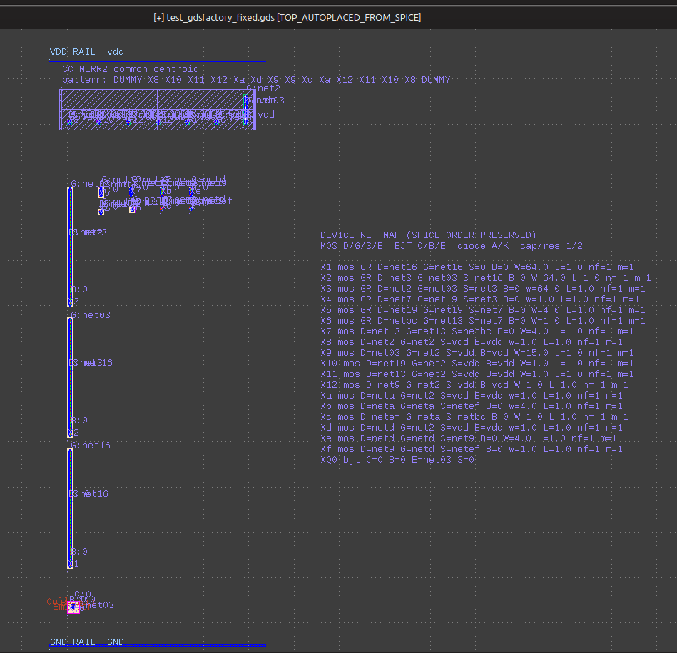](docs_assets/screenshots/02_gdsfactory_layout.png)

This view shows the gdsfactory/SKY130 Python-helper path. The terminal log shows the run was made with:

```text
Placement style : analogpro
Ratline GDS     : {'enabled': False, 'mode': 'off'}
Placed          : 19
Missing         : 0
Fixed GDS used  : 1
Direct draw used: 18
Unit arrays     : {'mode': 'plan', 'planned': 4, 'replaced': 0}
```

The screenshot shows three important things:

| Visual element | Meaning |
| --- | --- |
| VDD and GND rails | The script adds simple rail references to give the layout a readable vertical context. |
| Device map text block | The SPICE-order-preserved device map is written into the layout view for debugging. |
| Generated devices and labels | The MOS devices are generated through the direct-draw path and annotated with device/net labels. |

The purpose of this mode is to verify that the Python/gdsfactory side of the flow works without involving Magic guard-ring generation. If this mode fails, I usually debug the gf7 environment before changing any layout logic.

## Hybrid backend view

Terminal log: [03_hybrid_run.txt](docs_assets/terminal_logs/03_hybrid_run.txt)

[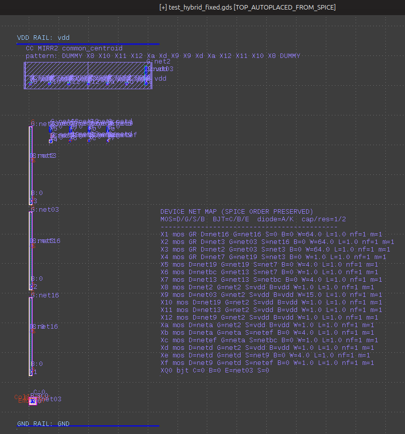](docs_assets/screenshots/03_hybrid_fullview.png)

[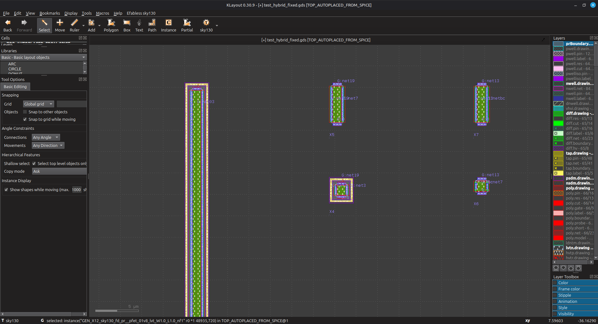](docs_assets/screenshots/04_hybrid_closeup.png)

Hybrid mode is the practical mode I ended up using most often. The idea is simple:

```text
selected guard-ring MOS devices -> Magic-generated guarded cells
remaining MOS devices           -> gdsfactory / SKY130 Python draw helpers
fixed primitives                -> fixed GDS import
```

The terminal log shows:

```text
Placement style : analogpro
Placed          : 19
Missing         : 0
Fixed GDS used  : 1
Direct draw used: 18
Guard-ring FETs : 4
Unit arrays     : {'mode': 'plan', 'planned': 4, 'replaced': 0}
```

The full view is useful to see the overall organization, while the close-up is better for checking generated geometry and labels.

| Screenshot | What it shows |
| --- | --- |
| `03_hybrid_fullview.png` | The complete hybrid-generated view with rails, placed devices, and device map. |
| `04_hybrid_closeup.png` | A closer KLayout view where individual device shapes, labels, and layer colors are easier to inspect. |

The reason this mode exists is practical. I hit issues while using the KLayout/Python guard-ring path directly for all guarded devices. Magic behaved better for the selected guarded devices, while gdsfactory remained useful for normal MOS generation.

## Magic selected guard-ring view

Terminal log: [04_magic_selected_run.txt](docs_assets/terminal_logs/04_magic_selected_run.txt)

[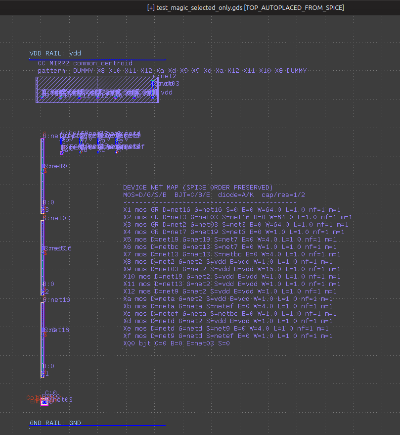](docs_assets/screenshots/05_magic_selected_layout.png)

This run checks that Magic selected-only behavior is working. The important point is that Magic is not blindly applied to every MOS device. The selected devices receive Magic guard-ring generation, while the rest of the flow still places the remaining devices normally.

The terminal log shows:

```text
Placed          : 19
Missing         : 0
Fixed GDS used  : 1
Direct draw used: 18
Guard-ring FETs : 4
Placement style : analogpro
```

This is useful because the older behavior was too aggressive for some experiments. I wanted a way to say: apply guard-ring generation only to the MOS devices I choose, do not convert the entire layout into guarded devices unless I explicitly ask for that.

| Item | Meaning |
| --- | --- |
| `Guard-ring FETs : 4` | Only the selected set received the guard-ring path. |
| `Missing : 0` | All expected devices were generated or imported. |
| `Fixed GDS used : 1` | The BJT/fixed primitive path still worked. |
| `Placement style : analogpro` | The placement is still topology-aware, not schematic-order placement. |

## Schematic-oriented placement

Terminal log: [05_schematic_run.txt](docs_assets/terminal_logs/05_schematic_run.txt)

[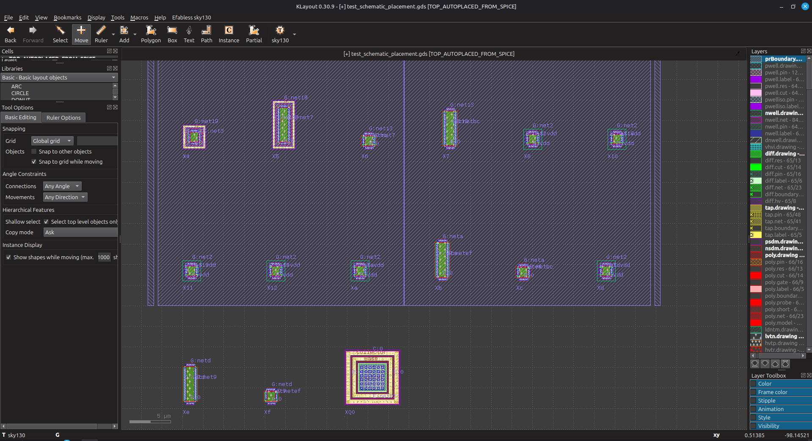](docs_assets/screenshots/06_schematic_closeup_layout.png)

[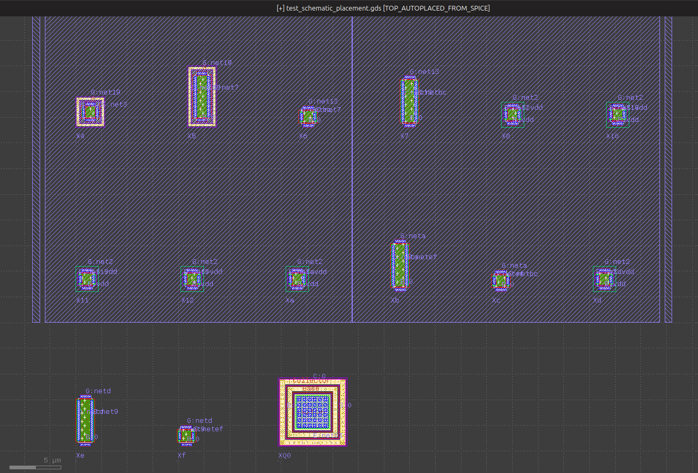](docs_assets/screenshots/07_schematic_overview.png)

[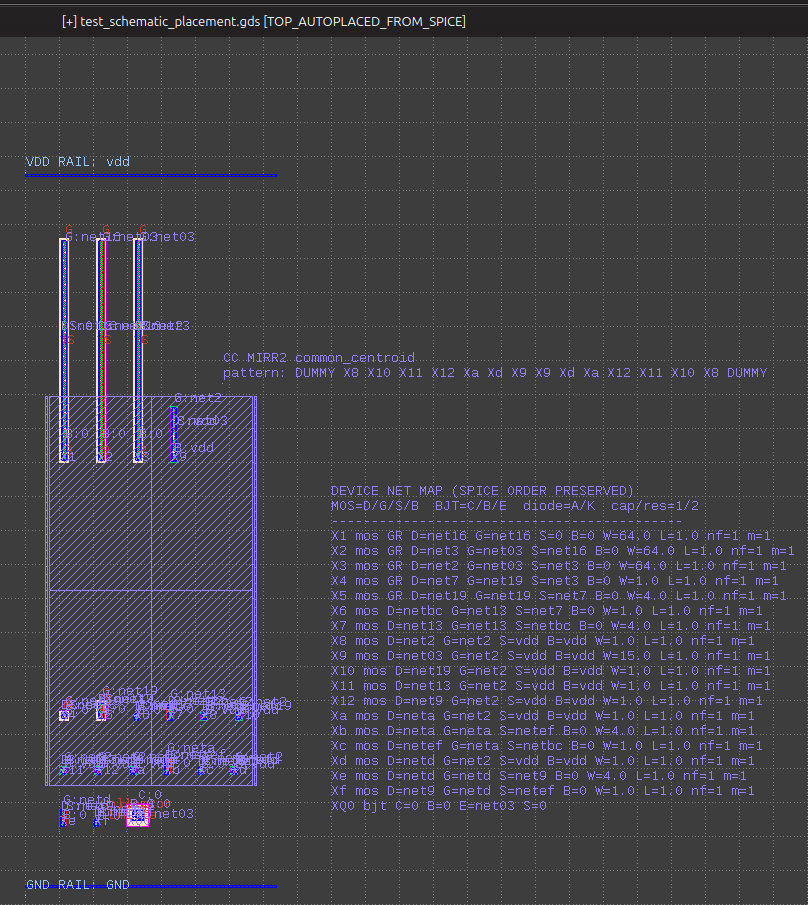](docs_assets/screenshots/08_schematic_oriented_layout.png)

Schematic-oriented placement is different from the normal `analogpro` mode. It tries to preserve a more direct relationship to the SPICE/netlist order. I wanted this because a clever placement can sometimes hide the original circuit structure. When debugging a generated layout, it can be easier to see devices in the same rough order as the source SPICE.

The terminal log confirms:

```text
Placement style : schematic
Placed          : 19
Missing         : 0
Ratline GDS     : {'enabled': True, 'mode': 'both', ...}
```

The three schematic screenshots show this from different zoom levels:

| Screenshot | What it shows |
| --- | --- |
| `06_schematic_closeup_layout.png` | A readable KLayout crop with devices placed inside a large marked planning area. |
| `07_schematic_overview.png` | A wider view showing the top-row organization and the fixed BJT cell below. |
| `08_schematic_oriented_layout.png` | A compact view with rails, the device map, and grouped devices visible in one frame. |

### Why this mode is useful

| Situation | Why schematic placement helps |
| --- | --- |
| Debugging netlist parsing | Device order is easier to compare with the source SPICE. |
| Checking labels | D/G/S/B labels can be compared with the printed device map. |
| Explaining the flow | It is easier to show how the netlist becomes a first GDS view. |
| Before manual layout | I can inspect the circuit organization before deciding a better final analog placement. |

This is not meant to be better than analog-aware placement. It is just a different debugging view.

## PCB-style ratline imitation

Terminal log: [06_ratlines_run.txt](docs_assets/terminal_logs/06_ratlines_run.txt)

[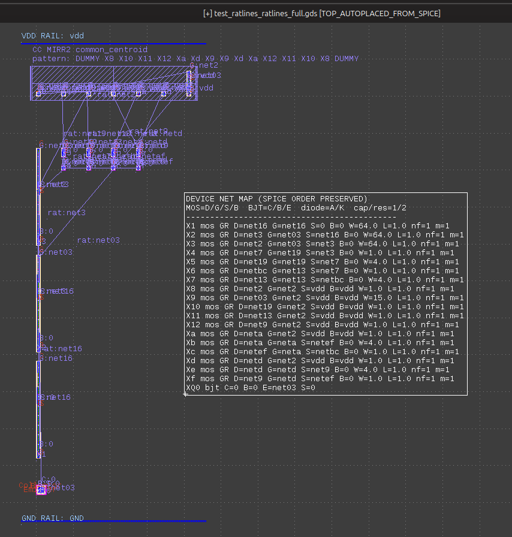](docs_assets/screenshots/09_ratlines_generation_overview.png)

[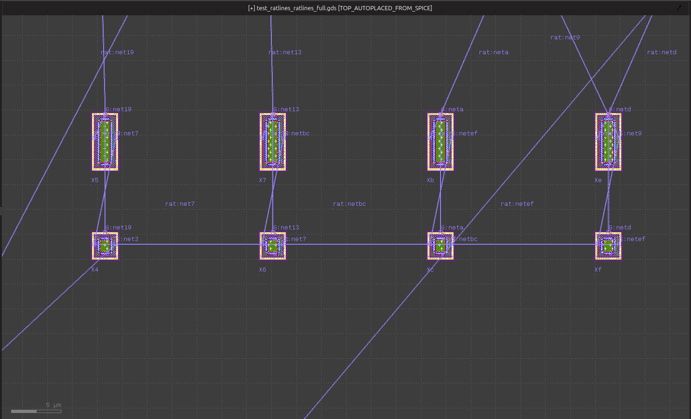](docs_assets/screenshots/10_ratlines_closeview.png)

This feature was inspired by PCB tools. In tools like KiCad, when a schematic is imported into PCB layout, the unrouted connections appear as ratsnest or ratlines. That visual cue is extremely useful because it tells me what still needs to connect, even before routing.

I wanted a similar idea for this SKY130 layout helper, but only as a static reference view. The tool creates separate GDS files for ratpoints and ratlines instead of polluting the clean main GDS.

The terminal log shows the ratline run created both reference outputs:

```text
Ratline GDS : {'enabled': True, 'mode': 'both', 'include_power': False, 'nets': 12, 'points': 47, 'segments': 35, 'labelled_nets': 12, ...}
```

| Ratline output | Meaning |
| --- | --- |
| `*_ratpoints.gds` | Terminal marker view. It marks the points from which ratlines can be created. |
| `*_ratlines_full.gds` | Static connectivity view. It draws non-fab reference lines between related terminals. |
| Main `.gds` | Clean generated layout without full ratsnest clutter, unless explicitly enabled. |

### What the screenshots show

| Screenshot | Interpretation |
| --- | --- |
| `09_ratlines_generation_overview.png` | Overview of generated static ratline geometry with the device map visible. |
| `10_ratlines_closeview.png` | Close-up of ratlines crossing between MOS terminals, similar to a PCB ratsnest view. |

### Important limitation

These ratlines are not live like PCB software. If I manually move devices in KLayout, the ratlines do not update automatically. They are just static non-fabrication reference geometry generated from the current device positions.

That limitation is intentional. I wanted a simple visual guide, not a full interactive router.

## Device and net marking

[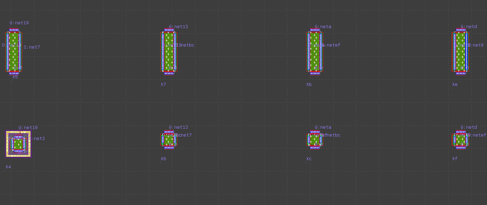](docs_assets/screenshots/11_net_marked_layout.png)

[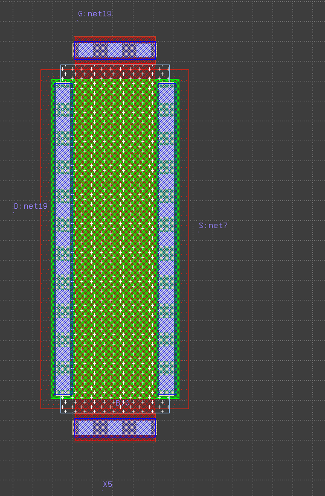](docs_assets/screenshots/12_device_net_marking_closeup.png)

The labels are a major part of why this flow is useful. Instead of only placing shapes, the script writes labels that preserve useful SPICE information directly in the GDS view.

The close-up image shows a MOS device with terminal labels such as:

```text
G:net19
D:net19
S:net7
B:0
```

This makes it easier to inspect whether a generated device is connected the way the netlist says it should be connected.

| Label type | Why it helps |
| --- | --- |
| Instance name | Helps match the layout device to the SPICE instance. |
| Gate net | Helps track signal/control connections. |
| Drain/source nets | Helps inspect current path and mirror connections. |
| Body/bulk net | Helps detect body-tie assumptions and source/body mismatch risks. |
| Device map text | Gives a full SPICE-order summary inside the GDS view. |

In a real analog layout flow, I would not keep every debug label in the final taped-out layout. Here the labels are useful because this project is about creating an understandable first view.

## Interactive wizard mode

Terminal log: [07_wizard_session.txt](docs_assets/terminal_logs/07_wizard_session.txt)

[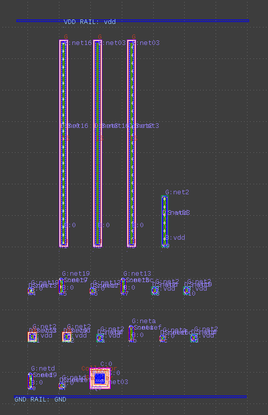](docs_assets/screenshots/13_wizard_generated_view.png)

[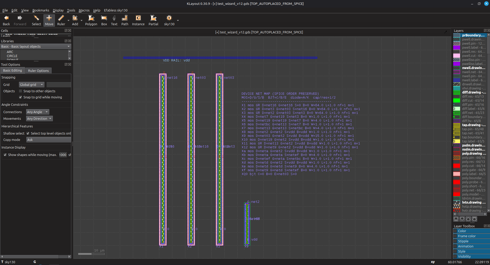](docs_assets/screenshots/14_wizard_closeup_layout.png)

Wizard mode is the terminal UI version of the flow. Instead of remembering every environment variable and command-line flag, I can run:

```bash
skyspice2klayout_all_magicgr_analogproplus --wizard examples/BGR_sky130_ckt.spice docs_wizard_showcase.gds
```

The wizard asks the important choices only:

| Wizard prompt | Chosen in this showcase | Meaning |
| --- | --- | --- |
| Run profile | `pro` | Enables the more useful planning/reporting behavior. |
| MOS backend | `hybrid` | Uses Magic for selected guard-ring devices and gdsfactory for the rest. |
| Placement style | `schematic` | Uses schematic/netlist-order placement instead of the analogpro topology placement. |
| Physical unit arrays | `Y` | Replaces planned large MOS devices with unit-array layout wrappers. |
| Common-centroid mode | `off` | Disables visible common-centroid marker mode for this wizard example. |
| Dummy mode | `marker` | Keeps dummy planning marker behavior available. |
| Magic DRC | `N` | Skips Magic DRC for this showcase run. |
| LVS helper | `N` | Skips LVS helper for this showcase run. |
| Ratline GDS | `both` | Creates both terminal-point and full-ratline reference GDS files. |
| Guard rings | selected list | Uses Magic guard-ring generation for selected MOS devices. |

The terminal log ends with a successful result:

```text
Placed          : 19
Missing         : 0
Guard-ring FETs : 7
Placement style : schematic
Ratline GDS     : enabled, mode both
Unit arrays     : mode layout, planned 4, replaced 4
Script done ... COMMAND_EXIT_CODE="0"
```

The first wizard screenshot shows the generated layout from that interactive run. The close-up shows the same result in KLayout with the device map text and tall unit-array style devices visible.

## What these screenshots prove

| Point | Evidence |
| --- | --- |
| The environment was configured correctly | [01_doctor.txt](docs_assets/terminal_logs/01_doctor.txt) shows `~/klayout_gf7`, SKY130 PDK path, Magic, Netgen, and gdstk. |
| gdsfactory generation works | [02_gdsfactory_run.txt](docs_assets/terminal_logs/02_gdsfactory_run.txt) shows 19 placed devices and 0 missing. |
| Hybrid mode works | [03_hybrid_run.txt](docs_assets/terminal_logs/03_hybrid_run.txt) shows selected guard-ring devices plus direct draw. |
| Magic selected-only behavior works | [04_magic_selected_run.txt](docs_assets/terminal_logs/04_magic_selected_run.txt) shows selected guard-ring count without missing devices. |
| Schematic placement works | [05_schematic_run.txt](docs_assets/terminal_logs/05_schematic_run.txt) shows `Placement style : schematic`. |
| Ratline reference files work | [06_ratlines_run.txt](docs_assets/terminal_logs/06_ratlines_run.txt) shows ratpoints and full ratline files with net/point/segment counts. |
| Wizard mode works | [07_wizard_session.txt](docs_assets/terminal_logs/07_wizard_session.txt) shows interactive choices and a successful final run. |

## What these screenshots do not prove

| Not proven | Why |
| --- | --- |
| Final analog layout quality | These are first-pass generated views, not manually finished analog layout. |
| Full DRC/LVS signoff | Some runs deliberately skip DRC/LVS helper checks. |
| Production autorouting | Ratlines are not routed metal. They are static reference geometry. |
| Live PCB-style ratsnest behavior | The ratline GDS does not update automatically after manual device movement. |
| Common-centroid correctness | Markers and plans are layout aids, not a substitute for careful matching layout. |


